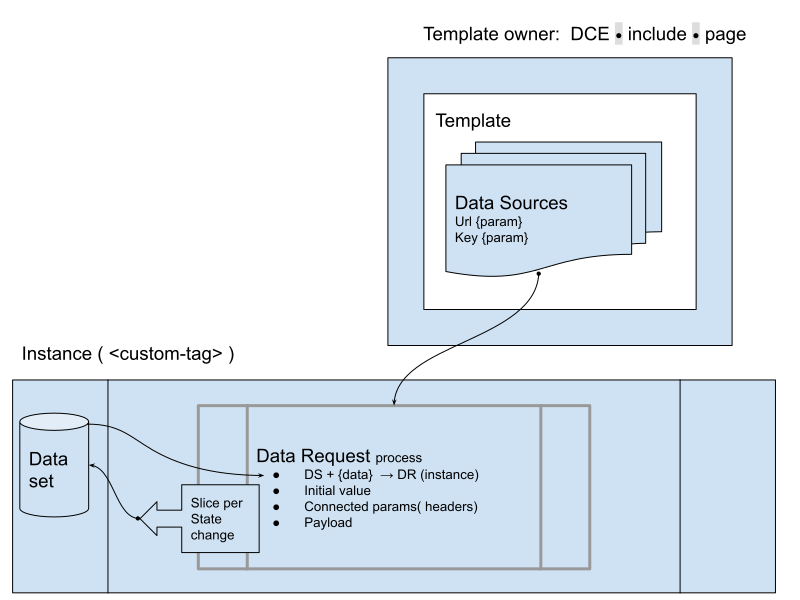

<h1>Introduction to Declarative Web Applications </h1>

This document explains the concept of Declarative Web Applications (**DWA**) and how they can benefit web applications created by Web Designers and Content Editors, along with DWA partners, contributors, and [patrons](./PATRONS.md). 

For example, Bluescape would benefit by reducing the attack surface in authentication flows and by making it easier to embed 3rd party apps on the drawing board. A Google Web Designer and Adobe AEM would benefit by having 3rd party injectable apps as an available component when composing own and partner apps.

The DWA initiative plans to have its concepts included as a part of the World Wide Web Consortium (W3C) standards that are adhered to by web browsers. The advantages of these standards benefit adopters of the workflow even prior to their recommendation by W3C. Business development would take advantage of seamless integration of 3rd party micro applications; SFO would value smaller cost of development; Security officers would be empowered by improved security due to reduced surface of attack.

A declarative approach to web application development (without JavaScript) has advantages that are not available in a JavaScript-centric approach. The proposed solution is not meant to match all the capabilities of a browser and a programming language; it instead provides a web application development on markup level that can be used in a restricted and secure manner.

# Table of Contents
* [Benefits](#benefits)
  * [Security Considerations](#security-considerations)
    * [Performance](#performance)
      * [Adoptable transformation layers](#adoptable-transformation-layers)
  * [Developer Experience (DX) and Development Efficiency (DE)](#developer-experience--dx--and-development-efficiency--de-)
* [DWA Stack](#dwa-stack)
  * [Heritage](#heritage)
  * [Truly Unified Resource Identifier (URI)](#truly-unified-resource-identifier--uri-)
    * [The deviation from current URI W3C definition](#the-deviation-from-current-uri-w3c-definition)
    * [Trust and resources certification](#trust-and-resources-certification)
  * [Declarative Custom Elements](#declarative-custom-elements)
    * [Page and DCE](#page-and-dce)
  * [Module loader and mapping](#module-loader-and-mapping)
  * [Libraries support](#libraries-support)
  * [Data Access Layer (DAL)](#data-access-layer--dal-)
    * [Data Source Declaration](#data-source-declaration)
      * [Inline data island](#inline-data-island)
      * [HTTP request](#http-request)
      * [Storage](#storage)
    * [Data Request](#data-request-slice)
    * [Data Response](#data-response-slice)
  * [Consistent access to object models](#consistent-access-to-object-models)
  * [Transformation pipeline](#transformation-pipeline)
    * [Data Request](#data-request)
    * [Data transformation and UI transformation pipeline](#data-transformation-and-ui-transformation-pipeline)
    * [DR & DT sharing across transformations](#dr--dt-sharing-across-transformations)
    * [Strict type check](#strict-type-check)
    * [Semver on API](#semver-on-api)
    * [Data Versioning with version change polyfills](#data-versioning-with-version-change-polyfills)
  * [Templating](#templating)
  * [Forms](#forms)
    * [Form states](#form-states)
    * [Form validation](#form-validation)
      * [External resources](#external-resources)
    * [Form output](#form-output)
* [Links](#links)

# Benefits
The advantages of Declarative Web Application (DWA) development for the vendor/browser implementer include extra security, performance, 
and reliability to the platform. Even if the process is not completely supported by W3C it still has many benefits to both internal and external parties. The following cases detail where it would be valuable:

* Authentication flow in custom apps (based on electron, QT, etc.)
* Site builders
* Content management systems
* Web 3.0 multi vendor app portals
* Embedded devices where memory and CPU resources are limited
* Internet of Things (IoT) management tools, especially due to backward compatibility polyfills layer.
* Highly responsive dynamic UI (like video set-top box), which require reliability over extended periods of time, and minimized memory allocations and/or * * * multithreaded sub-flows

## Security Considerations

* No JavaScript as a source of cross-domain infiltration makes this development method inherently more secure.
* Permitted operations are subject to strict rules in browser runtime and discoverable by code analyzers.
* The ability to safely embed a DWA as a micro-application into a host web application, with minimal to no micro-application container code. 

## Performance

Declarative custom elements coupled with other aspects in declarative syntax lead to natively compiled multithreaded web apps.

* **Loading**: The declarative application can be initialized completely in the pipe of the source stream reader. As there is no need to pause for single-threaded JS execution, the branched threads would be served in the same fashion as usual HTML loading flow with sync on-the-need basis like during document dependencies load (css, fonts, etc.).
* **Data dependencies**: These can be treated in the same fashion as HTML document dependencies, they are synchronized with the HTML loading lifecycle and Document Object Model  (DOM) elements they are a part of. The hydration of UI with associated data would be a browser responsibility and turned on as-needed with platform specifics and runtime considerations taken into account.
* **Native multithreading**: As data dependencies within transformation are known, data transformation pipelines can be executed in parallel. Various UI components with their own data/dependencies flows can run in their own threads, synchronized only on the dependencies life cycle.
* **Binary code**: When data and events execution defined as transformation pipeline declaratively and in/out data schema is known, the next logical step is to generate the binary code.
* **SSR vs transformation pipeline caching**. Any part of the transformation pipeline is serializable and can be stored and later served to become a part of further DWA lifecycle. The whole DWA or one of transformation pipelines sub-chain can be pre-rendered on server side or in browser and cached to be reused without processing again. This process, sometimes called memoization, is applicable as for data as for UI pipelines. Unlike in classic memoization, 
here it would be just a hint to a system which could free the associated resources as needed.

**Memory**:

* Data transformation/processing can begin on loading (for streaming applications).
* The memory would not be allocated for unused data at the moment of streamed data reading.
* Intermediate data would be disposed of immediately after delivery to the target. For example, once it is rendered into HTML.

### Adoptable transformation layers
Some environments could be performance optimized and parts of the transformation pipeline trimmed off. For example if the original messaging is in English(US), there is no need to apply localization. The support for screen readers can be triggered by the browser dynamically only when it is activated; after extensive use the unchanged server-side APIs can bypass the schema validation, and so on up to the level of bare minimum needed in a particular situation.

## Developer Experience (DX) and Development Efficiency (DE)
As many aspects of web application flow would be implemented by the platform itself, those would come out of the development scope. Examples include loading of data, filling into templates, and rendering HTML out of the template. 

**DX on Data schema change**: The schema checks against used data and allows it to highlight the missing/changed objects in the data source and track the effect of changes.

**Schema validation** becomes a part of the loading and runtime check. Dev tools would highlight the warning and error on the network access level and lead to affected behavior troubleshooting flow: the transformation parts and up to affected UI parts highlighting.

**Debugging & troubleshooting** goes to a  new level. The debugger embedded into the browser and in addition to the call stack it would provide the transparent exploring from generated DOM level via transformation up to the remote data source fields. 
The [devtools plugin](https://chrome.google.com/webstore/detail/epa-wgcustom-element/hiofgpmmkdembdogjpagmbbbmefefhbl) is now available for DCE and would adopt the hierarchy of data and transformations on the page to navigate through and debug each transformation individually.

**The pipeline of incremental improvement** for UI would give ability to apply [AOP](https://en.wikipedia.org/wiki/Aspect-oriented_programming)
approach for feature based modular development. The layers of localization, analytics gathering, accessibility would be easier to be implemented and deployed independently. 

Going further the complimentary pipeline layers can be applied only for particular environments or user sessions. Jus as a sample,

* test IDs generated only during the end-to-end or unit tests, 
* inline translation editing for lingual team members, 
* feature flags would alter different transformation flows and finally UI. 

# DWA Stack
## Heritage
On the shoulders of giants the new web stack would extend the best from HTML5 and XML/XSLT/XPath. It would account for the mistakes and missing essentials as in dev capabilities as in DX/DE. 
In particular, it would address the syntax complexity of XSLT and XML namespacing, would provide simple aliasing to the lingual complex constructs, make a clear flow for troubleshooting and discoverability in the transformation flows. 
It would provide the ability to reuse the HTML 5 templates along with the XSLT codebase with minimal (target none) changes.

# Scopes insulation and sharing
Since DWA can be embedded into web page, desktop, and into each other, and be served by different vendors  

## Truly Unified Resource Identifier (URI)  
A Unified Resource Identifier should be available for consuming resources of all kinds within the current element scope. The resource has to be identifiable when it resides

* on page Document Object Model (DOM) 
* On module loader for the scope ( say a module ID like NPM package name )
* On a shared locations on the web (CDNs or web hosts) file
* Within external file along with other resources

The perfect sample is a reusable template. When it resides in the page, **#id** is used to reference the DOM node on the component root or page. This template could be referenced multiple times but the same read-only DOM has to be used for rendering associated HTML without the need for a clone. In case the template is referenced by external to page URLs (domain.io/template.html), its content is loaded once in the same manner as the HTML module. However, when the URL has a hash selector (domain.io/template.html#id), the template would be located within an external document by its ID. 

The URL resolving is a subject for module loader and mapping.

### The deviation from current [URI W3C](https://www.w3.org/wiki/URI) definition
In addition to location, the new functionality would assume the reuse of resources and the whole life cycle of loading. The module identifier is a part of URI and given an abstraction of the loading sequence, not the actual location of the resource.

### Trust and resources certification
In addition to usual server connection validation via https, the resources have to be individually verifiable on

* Data integrity level, same as subresource integrity for SCRIPT. This pattern has to be applied to all resources including the DWA descriptor and its parts.
* Common convention on client side how to retrieve the list of available resource registries and certifications access.
* Common convention for various digital certificates enumeration on registry and relative to resource location. 
* Variations of certificates would include but not limited to 
  * vulnerability report
  * Code complexity and quality
  * Test coverage
  * Etc.

The certifications of the same type could be done by different vendors and a DWA descriptor would define the algorithm of trust chain selection and validation.
  
## Declarative Custom Elements
Is the way of embedding DWA into web page.

### DWA, DCE & WC
DWA is a [microapplication](https://github.com/EPA-WG/EPA-concept/blob/master/microapplication.md)
when injected into page or another DWA. It is a WC from prospective of container. 
Only difference between DWA and WC is default insulation rules: 
DWA injection should not produce any side effects while the ordinary WC has access to
whole page via JS and some CSS. The Declarative Custom Element should be side effect
free as DWA. What would be the difference between DWA and DCE than?
Both can be loaded from external location or from embedded content. Both are side effect free.
DWA can be instantiated multiple times, DCE is designed for the same. Both can be containers. 
The life cycle, loading priority, hydration rules are same as well. 
In other words, DWA and DCE are the same from implementation point of view. 
Only rhetorical meaning is a denomination.

* The application usually assumed to be self-sufficient and have own business use. 
* The component is meant to be used in the context of another application along 
with other ones. But there is no straight line in between

But each of above are interchangeable. DCE could be opened as an application and 
DWA could be injected multiple times as DCE.

#### High level requirements
* Self-sufficiency, i.e., completely declarative syntax to support Declarative Web Application concept (no JavaScript)
* Support for passing parameters/data
* Declarative events to data transformation binding
* Support distribution of data or parameters into any part of the Declarative Custom Element (DCE) content definition, i.e., Treat DCE content as a generic template.
* Support Minimum Viable Product (MVP) for templates with conditions, loops, and multiple inserts of data into different parts of the template.

#### Pieces of the template
* HTML DOM or text insert (slots only syntax?)
* Element attribute or attribute part (just text)
* data as output (for example into value or dataset)

#### DCE also meant to work as a part of DCE collections (libraries) and application, would therefore support
* Distribution as an independent module, i.e., declarative import syntax
* Name mapping, i.e., to export own names with import renaming
* Import of DCE collections (HTML with related DCE)
* References using namespace to avoid library naming collision
* DCE imports that are compatible with import maps, i.e., defined with a symbolic name in app and mapped to distribution (NPM, CDN, etc.) through an application descriptor

[DCE W3C group discussion](https://github.com/w3c/webcomponents-cg/issues/32),
[Functionally complete declarative templating](https://github.com/WICG/webcomponents/issues/997)
WICG proposal

### Page and DCE
As DCE can be embedded into each other and the page, the page is also treated as a top-level DCE. Without templating capabilities it matches HTML 5 exactly, but application and page level data are available to be consumed by transformation instructions. Such page is a Declarative Web Application itself and can be embedded as microapplication into another application allowing creation of portals with fine-grained secured application scopes.

## Module loader and mapping
All resources, including DCE, templates, and bound dependencies like CSS, images, fonts, etc. can be treated as a module with a loader and an import maps resolver. 

The resolved resource could be reused by the platform, and loaded and unloaded at any time. The caching strategy would match the browser, but caching storage could vary depending on the implementation.

## Libraries support
The multiple modules in any tier library (UI, data, transformation) could use the same “namespace” for common data, algorithms, web components, and styles. 

## Data Access Layer (DAL)
* Reference by URI. The data as runtime resource TBD
* Data query, query parameters in URI
* Storage: perhaps exposing local/sessionStorage, virtual file system, and XML/DOM data island
* Data scope: application, (sub-)domain, library, DOM sub-tree, and namespace
* Data lifecycle: persistent in app, session, named session, and inline (bound to the owner)

DAL life cycle
1. [Data Source Declaration](#data-source-declaration)
2. [Data Request](#data-request)
3. [Data Response](#data-response-slice)
4. [Transformation Pipeline](#transformation-pipeline)

The [DSD](#data-source-declaration) is used during development and optionally during application load to validate the application code against data schema. IDE would highlight the mismatch in fields, CI/CD validator would do the type errors check. 

[Data Request](#data-request) provides the actual retrieving mechanism and feeds 
the DSD plus its own data into protocol-dependent request. 
This request would produce the [Data Response](#data-response-slice) variations.
[Transformation Pipeline](#transformation-pipeline) converts the response data into consumable by application format propagated further into components as an input parameter.

It is assumed that data retrieval and initialization would not modify anything in the application and do not change over time. I.e. could even be a JS module exporting JSON data. 

### Data Source Declaration
The data source declaration would have 
* the protocol with complimentary parameters to retrieve 
* optional expected data schema

The DSD is a static descriptor which can be defined in application or in any scope and reused for multiple Data Requests or inlined within Data Request itself. 

The protocols for data retrieval would vary: Inline data island, HTTP request, Storage of various kind, etc.

#### Inline data island
Depending on the data type it could be DOM( as HTML or XML), Object ( script constant or JSON ), or any HTML-encoded content. The proposal for JS-like data island and attribute TBD.

#### HTTP request 
Include method, headers, authentication protocol and parameters, encoding, etc. The GraphQL, RESTful,  SOAP are the samples of HTTP request types. 

The current and future data access protocols to be supported. XML/JSON RESTful, GraphQL with subscriptions, etc. But the first draft would include only straight 1-way transformation with streaming support. The streaming pattern would eliminate the need to keep intermediate data during transformation in many cases.

#### Storage
Local/Session/Cookies/DB/Virtual FS are the samples of storage. 

### Data Request slice
Is a connection between component or transformation pipeline and [DSD](#data-source-declaration).
It fills out parameters for retrieval protocol and initiates the data retrieval itself.

### Data Response slice
The result of data retrieval is exposed as Data Response. Depending on protocol it could be pure data or combined with response parameters. 

For example, for HTTP protocol it could be network error, HTTP status, response headers, etc. The body would be treated as a result in most cases but interpreted according to response status, content-type and payload. 

Consumer code (transformation pipeline or component) would consume the result data.

## Consistent access to object models
Whether it is a custom element registry, the form, or any another object/collection in DWA it should support 

* Persistence, i.e. serialization. While the interfaces are meant to be the same, implementations would be able to choose the actual format: binary, shared memory, XML, json or custom like CSV. The streaming-first approach.
* Objects are treated as immutable. Immutability of objects are essential for
  *  Sharing across DWA scopes,
  * Passing across threads including transformation pipelines, service/web workers, clipboard, OS applications, etc.
* Object lifecycle support: CRUD and custom verbs.
* Object monitoring/observable: lifecycle notifications
* Discoverability: enumerate collection, filtering/search/pagination. While those are usually associated with remote data, the interface has to be unified to support the same programmatic access. It would make the data layer scalable. 

## Transformation pipeline
The Data Source(**DS**) gives a definition of how the data would be retrieved, validated, and interpreted. DS is a part of template and its parameters are dynamic and during template transformation are filled out from template owner data set.

### Data Request
During transformation the Data Source would be instantiated as Data Request(**DR**).

DR is a process which is initialized by parameters from transformation of DS. Once initialized, it would go over data retrieval phases. Some DS are synchronous like localStorage and give the final data slice immediately. Some are just asynchronous like IndexedDB with one final slice. Others multi-state like HTTP requests.

When DR has a state change, it notifies the transformation owner that its own instance data slice and state is available. Transformation owner would mark current cycle as incomplete and save the slice to be available in following transformation retry.

The transformation cycles are completed when all DR states are final.

### Data transformation and UI transformation pipeline
Often the retrieved DR data needs to be changed to fit the UI transformation 
expected format. Data Transformer (**DT**) would convert the DR to format acceptable by UI transformation. From the transformation owner perspective the Data Request and Data Transformer are identical: they both are going over state changes and produce the series of data slices. 
Unlike DR, DT as an input takes the DR name as input dependency. 

During instantiation DT is marked as waiting for dependency DRs. Once all DRs are in final state, it's time for the DT transformation cycle, and finally the UI. 

## DR & DT sharing across transformations
TBD

[Data transformation pipeline in custom-element](https://github.com/EPA-WG/custom-element/blob/main/datasource.md)
implementation notes.

### Strict type check
The data against schema validation is one of the transformation pipeline layers. 
Since the complete schema check is expensive, the **run time** validation would be 
an alternative option compliant with _schema semantic versioning_. 
But in case of data source mismatch to consumed format, the type error has to be treated in the same fashion as schema validation error. In case of missing error handlers the transformation pipeline should be capable of rolling back to the stage of data feed opening. 

### Semver on API
While the back-end API schema validation is out of scope of DWA, its support would naturally fit into client design, see the strict type check ^^.

### Data Versioning with version change polyfills
The pipeline tier would produce the data in particular schema which would change over the time. It would be essential for external DWA feeds like web services. 

In order to support the smooth transition between versions where possible, the web service API vendor ( or transformation module owner) could provide the polyfill which would transform the current format into the expected by client version. Sometimes the transformation would be more sophisticated than 1:1 feed change and would include as some logic as other data feeds. The transformation pipeline language would be the way of implementing such data version polyfills.

Such polyfills would open the long term support for clients created way back in the past and guarantee the future
compatibility of clients as _evolutionary architecture approach_.

The semver on web service APIs would make the cost of change adoption minimized. Win-win on server and client side.

## Templating
The templates themselves have to be reusable when applied multiple times. There is no template cloning needed( as opposite to template tag)  and has to be discouraged.

The perfect sample of reused template is an avatar SVG image. When it is applied in DOM, there should be no cloning, just a reference to the image as a template.

Must support the following:
* [Multiple usage of slots with the same name](https://github.com/WICG/proposals/issues/76)
* Loop over collection
* Condition
* [Slot values in attributes and attributes parts](https://github.com/WICG/proposals/issues/77)
* Data binding as slots payload, root node [dataset](https://developer.mozilla.org/en-US/docs/Learn/HTML/Howto/Use_data_attributes)
as the default data binding, context access (local storage, url, etc.); payload as input to support incremental DOM improvement as DOM level transformation pipeline.

See [@epa-wg/custom-element](https://github.com/EPA-WG/custom-element) as PoC

## Forms 
All life cycle states and data would be exposed to DWA. 

### Form states
* Clean
* Modified
* Pending|Error
* Submitted
* Named custom state

Those states are applicable to the whole form as to particular form fields. The form and field state could be consumed by CSS and component logic  to style and adjust UI components. 

The states would reflect the lifecycle of the form object. In this cycle the form can be eventually materialized as an object without UI, pre-populated with default values, shown in UI, focused and filled out, and finally submitted with particular result values. Once not needed the UI would be removed and later the form object discarded.

### Form validation
The advanced forms use requires complex validation with data transformation pipeline and verification of form elements against a series of rules.

#### External resources 
in the form are the usual case, those can be referenced as by direct URL as by some unique ID. The input value would match the ID but the validator has to be capable of 

* Injecting the ID into request
* Define validation rule like 200 HTTP request status or presence of ID in one of response objects

The transformation pipeline which would take the UI values as an input and goes over a series of queries to pass the invalidation rules.

### Form output
The form object is the final product of the submit process. Of course this object could be passed to another page via form POST but the primary use is to initiate the transformation pipeline on the page which would lead to the next state of DWA, whether it is an SPA, microapplication, or a portal. 

# Links
* [2022 - developing web (with components) should look like in 5 years](https://github.com/EPA-WG/EPA-concept/issues/5)
* [Declarative custom elements - teaser](https://github.com/w3c/webcomponents-cg/issues/32)
* https://discourse.wicg.io/c/architecture/13
* [Google Web Designer](https://webdesigner.withgoogle.com/) - enlist the use cases for DWA
* List of [HTML as application](http://discourse.wicg.io/t/proposal-html7/5860/9?u=suns) proposals
* [Password hashing](https://discourse.wicg.io/t/html-server-relief-password-input-attributes-for-client-side-hashing/793) proposal, 
* [form fields validation](https://discourse.wicg.io/t/validate-mime-type-for-input-type-url/6072)  